# Wander: A deep dive into UI/UX and mobile dev for a Strava-like social discovery app

A short write-up on building **Wander**—a social life-logging and discovery app with gamification to incentivize positive city behavior. Inspired by Strava and Beli, but focused on "joymaxxing" and supporting your metropolis: public transport, local business, volunteering, and community infrastructure.

---

## What we built

Wander is **Strava for joymaxxing**. Like Strava tracks runs and cycling, Wander tracks **where you go, what you did, who you were with, and how it felt**—then turns that into streaks, civic points, and personalized recommendations.

- **Social life-logging and discovery** — Log outings, check-ins, and experiences; discover places and events through a feed and map.
- **Gamification** — Civic points, badges (Local Supporter, Cleanup Crew, Community Builder), streaks, and a leaderboard to make supporting your city tangible and fun.
- **Incentives for positive behavior** — Badges and points for volunteering, patronizing local businesses, organized hangouts, and public transport use.
- **AI-powered suggestions** — "Tonight's recommendations" on Profile and AI-generated day plans (itineraries) from vibe, budget, and hours outside.

We took inspiration from **Strava** (tracking, sharing, streaks) and **Beli** (local discovery and community), but oriented everything toward maximizing real-world joy and reinforcing behaviors that help the city.

---

## UI/UX and mobile experiments

We ran a single codebase across **Expo (React Native)** and **web**, with platform-specific screens for map and itinerary. Here’s how the app feels, with screenshots in order.

**Login.** First touchpoint: sign-in (and sign-up) before the main app.

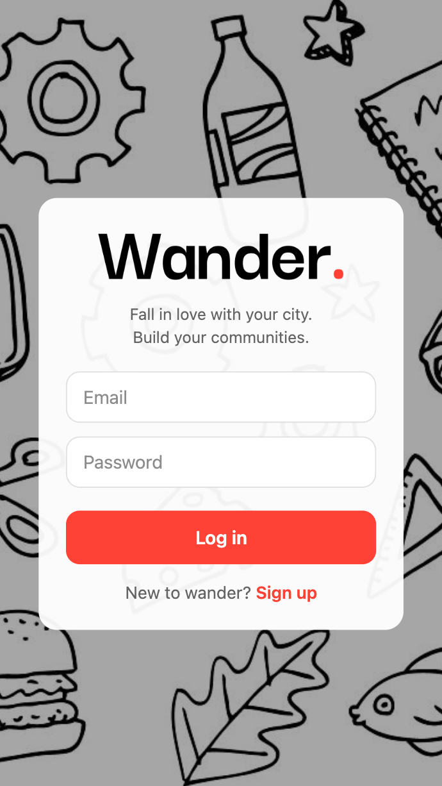

**Explore — map and places.** Pick a city (San Francisco, Boston, Providence), see places and events on the map, tap for details and "Get there" for directions and cost (transit vs rideshare).

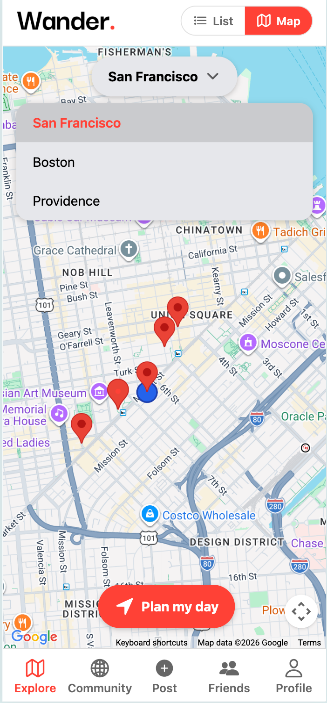

**Community feed.** Check-ins and volunteer events in one feed; join events to earn civic points.

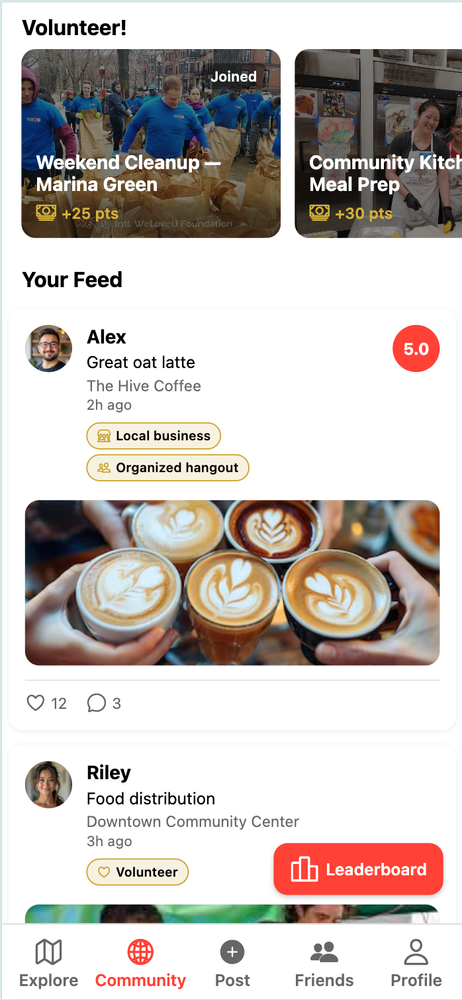

**Volunteering and plans.** Plans can include volunteer events. We experimented with surfacing "volunteer day out" options and an active plan that mixes places and community events.

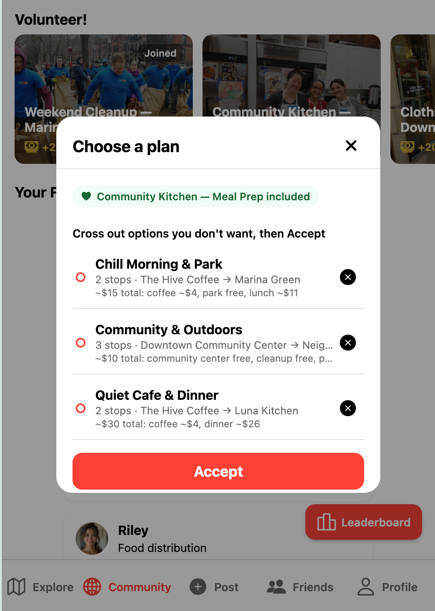

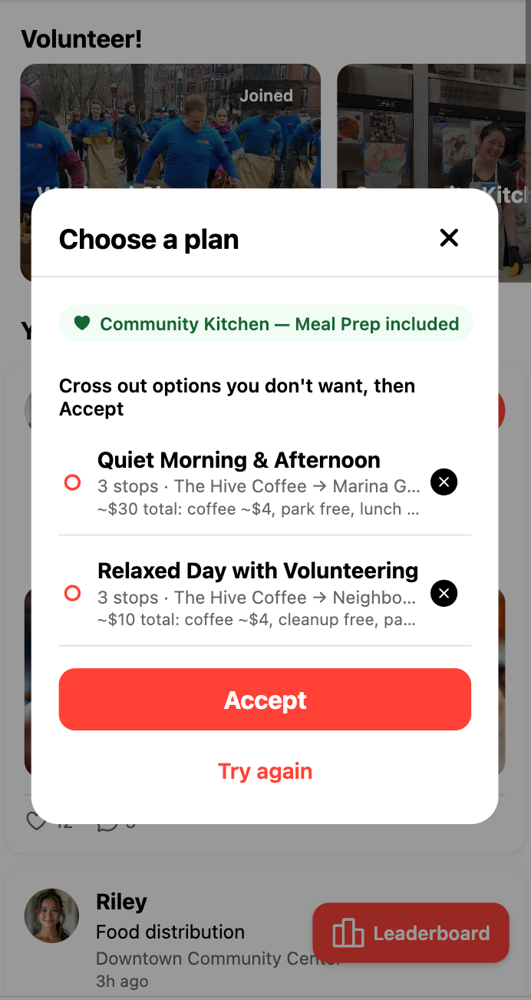

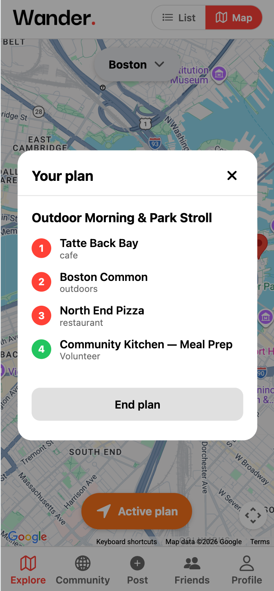

**Plan generation.** One modal, three modes: form (location, vibe, budget, hours) → generated options (with cross-out) → view plan. Here, generating options for Boston.

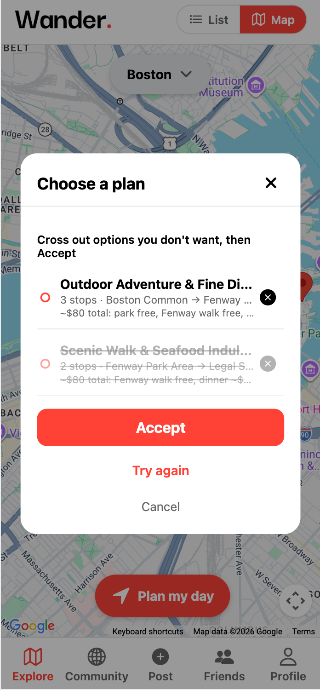

**Directions and cost.** "Get there" shows driving and transit options and surfaces cost (rideshare estimate, fixed transit cost) so users can choose.

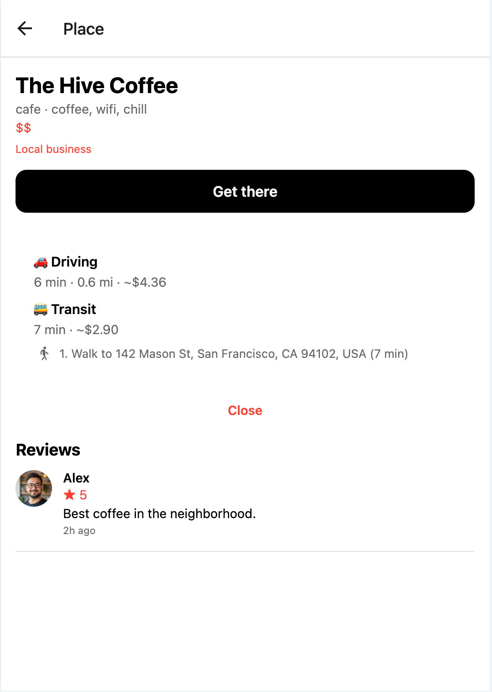

**Profile — gamification.** Points, level, badges (unlocked by thresholds), and progress to the next badge.

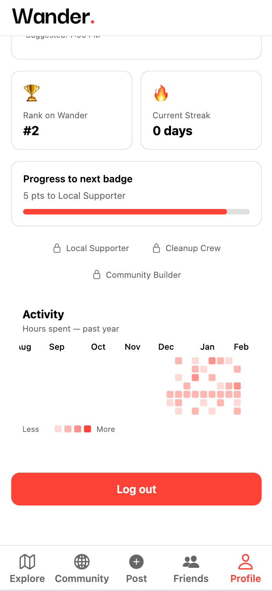

**Tonight’s recommendations.** AI-suggested places (Gemini or fallback) based on preferences and friend activity.

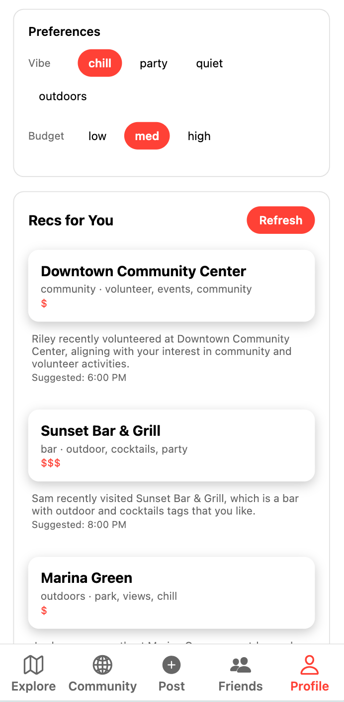

**Friends and leaderboard.** Friends list and a leaderboard by civic score so the social and competitive angles stay visible.

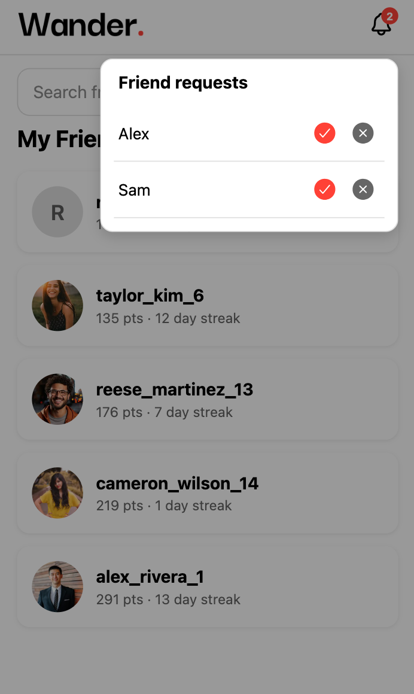

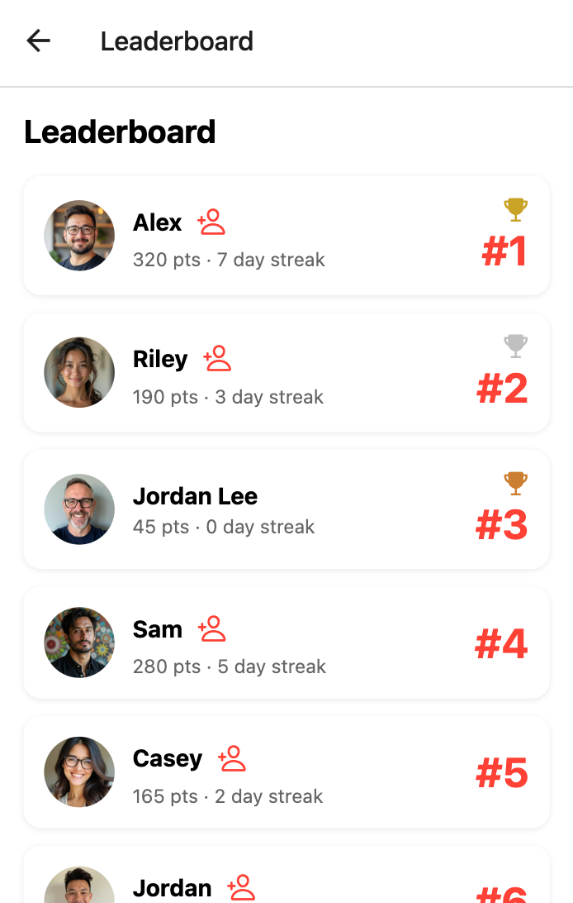

**Post flow.** After a check-in (e.g. post-hackathon), users can log what they did, who they were with, and tag the experience—feeding back into recommendations and streaks.

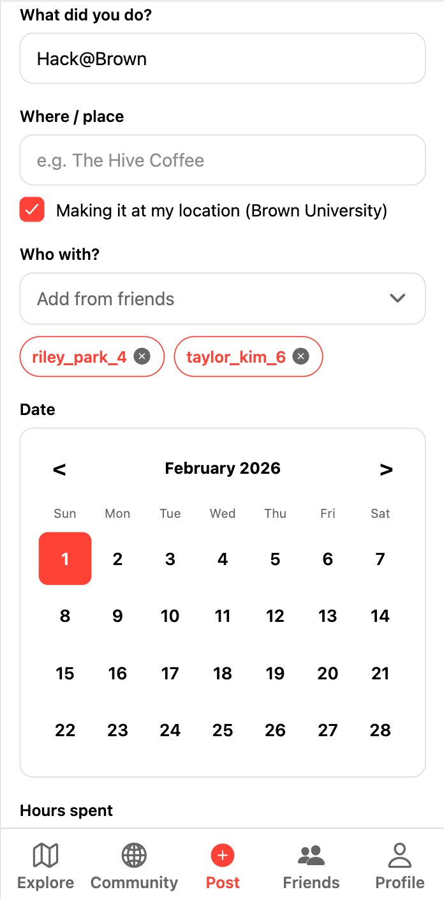

---

## Technical challenges (non-trivial)

### Context management and compaction for low-latency LLM queries

The interesting technical work was **what we send to the LLM and how we keep it small**. We never send raw history.

- **User context is summarized:** `categoryCounts`, `tagCounts`, `lastChosenPlaceIds` (capped at 5 in the prompt, 10 in state), plus `vibe` and `budget`. No full post text or long narratives.
- **Friend context:** Only the **last 10 check-ins**, sorted by time, turned into short sentences (e.g. "Alex volunteered at Downtown Community Center — Food distribution"). No unbounded activity streams.
- **Places:** One line per place: `id | name | category | tags | priceTier`. The model suggests from this candidate list by ID.

**What we excluded:** Full post text, full review text, unbounded history, and images. That kept prompts small and responses fast.

**Tradeoffs:**

- **Small, fixed context** → lower latency and token cost. We use `responseMimeType: 'application/json'` and `thinkingBudget: 0` so we get fast, parseable JSON without extra reasoning tokens.
- **Fallbacks:** When there’s no API key or the request fails, we fall back to demo recommendations so the app always feels usable.
- **Itinerary vs recommendations:** The itinerary prompt uses only constraints (location, vibe, budget, hours) plus the same compact `placesSummary`. We deliberately did *not* include friend activity in the itinerary prompt to keep that flow simple and fast.

**State and navigation.** The plan icon lives in the **header on every tab**; one "open plan" action from anywhere opens the same modal. What the user sees is derived from state: active plan → view plan, pending volunteer event → form (with that event in mind), else → form. So "see my plan" and "plan my day" are one affordance, no "go to Explore first." Tapping a volunteer card either adds that event to an existing plan or kicks off the plan flow with that event pre-selected (`pendingEventId`); plans store both `placeIds` and `eventIds`, so the mental model is "this volunteer event is part of my day" without extra steps. **Dual state:** Redux for auth only (gates the shell); Context + `useReducer` for profile, plan, posts, events—with plan (including `eventIds`) and profile persisted to AsyncStorage. **Price in the loop:** Itinerary options from Gemini include a `priceBreakdown` string per option so users see cost when choosing a plan; budget stays a first-class constraint.

**Other choices:** CORS proxy for web (Directions + Gemini); demo-first data merged with API (places/events in code; backend for auth and friend requests); platform-specific map screens (react-native-maps vs Google Maps JS) for web vs native.

---

## What we learned

- **Compact, deterministic "memory" for the LLM** made recommendations and itineraries fast and predictable. Deciding what to include and exclude up front beat tuning model params later.
- **One modal, three modes** (form → results → view plan), with mode derived from global state, kept the plan flow in one place and reduced context loss when opening from any tab.
- **Gamification** (points, badges, leaderboard) gave a clear, non-preachy language for "supporting your city"—users see progress and compare with friends without feeling lectured.

---

## Take-aways (engineering wisdom)

- **Design the context before the model.** The biggest lever for LLM latency and cost was *what we didn’t send*—no full post text, no unbounded history. Structured summaries and fixed caps (e.g. last 10 check-ins) made behavior predictable and debuggable.
- **One entry point, state decides the step.** A single "open plan" action from any screen, with mode derived from `activePlan` and `pendingEventId`, avoided multiple "open form" vs "open view" flows and kept the mental model simple.
- **Demo-first isn’t a hack—it’s product.** Fallback recommendations and merged demo data meant the app was always usable for demos and interviews; we didn’t hide features behind "no API key."
- **Split auth from feature state.** Redux for auth (hydration before shell), Context for the rest (parallel hydrate), gave a clear boundary: "can you use the app" vs "what you’re doing in it," and kept feature state out of the auth critical path.

---

## Try it

Repo: [Wander](https://github.com/shivraj-S-bhatti/wander) (or your actual repo URL). Clone, add API keys (optional; app works with fallbacks), and run `npx expo start --web` or `--ios`. I’m happy to talk through the design and technical choices in interviews.
